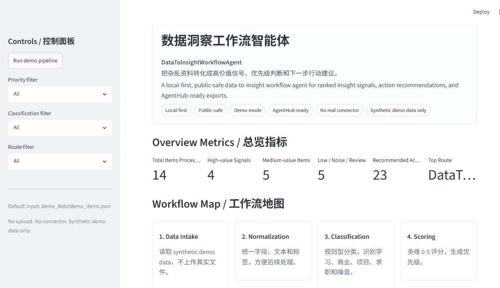
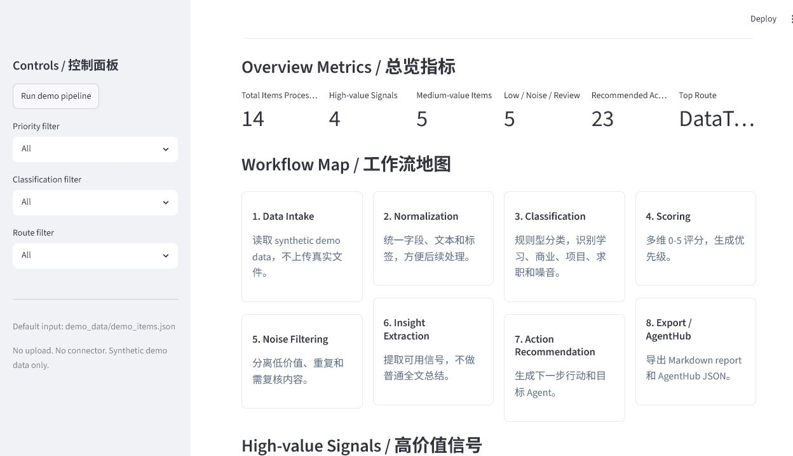
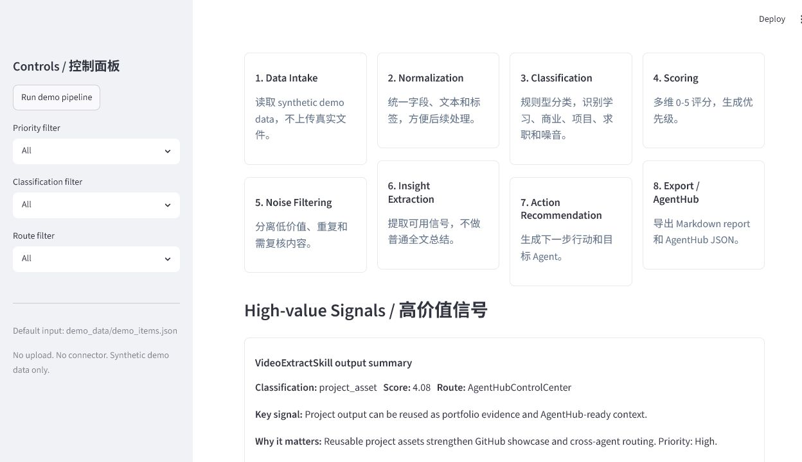
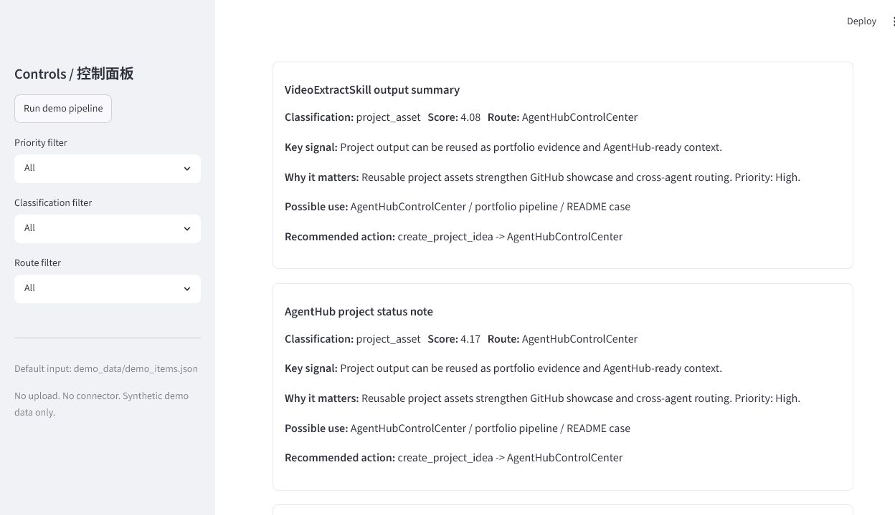
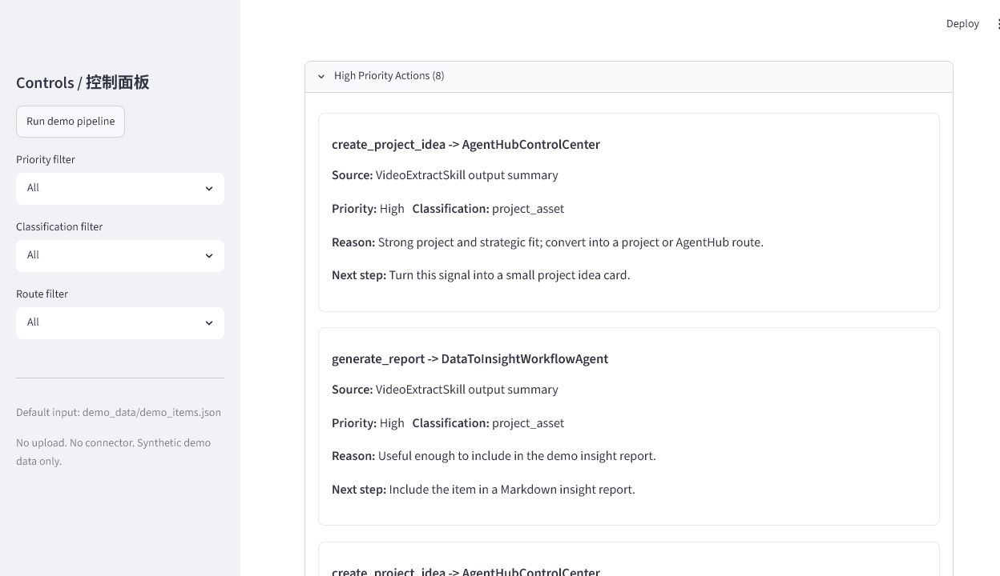
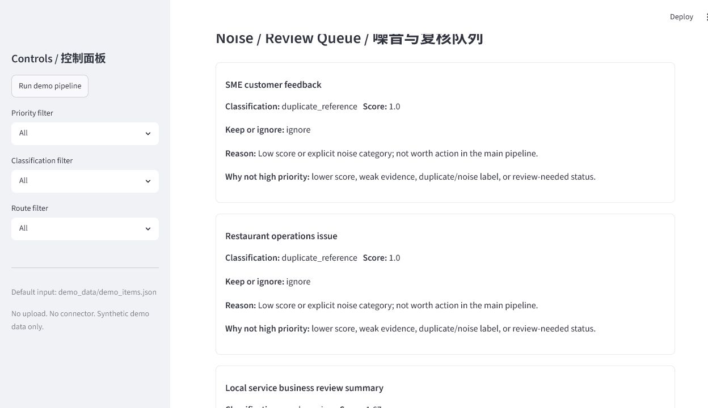
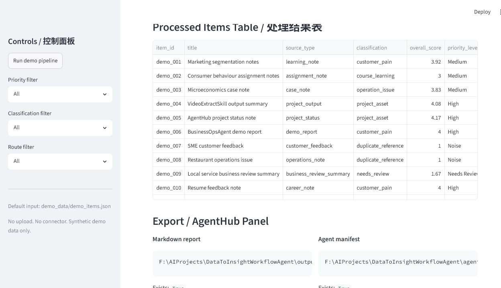
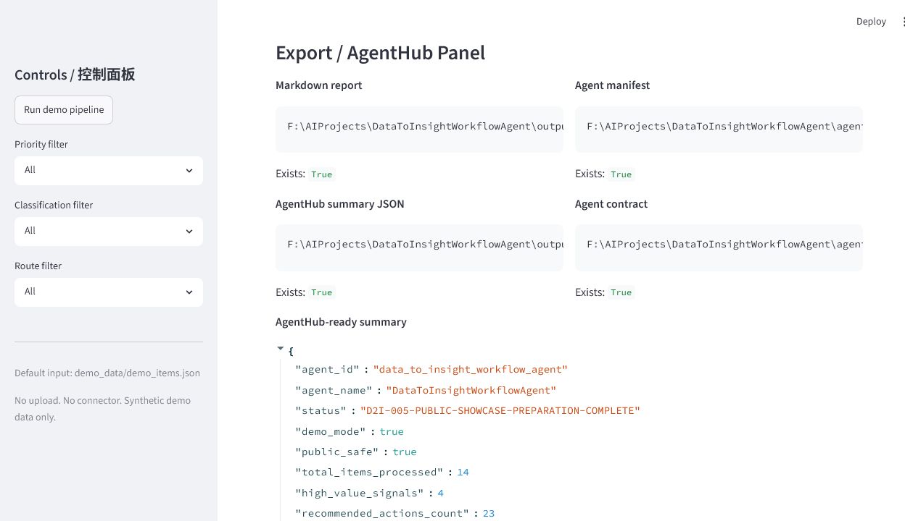
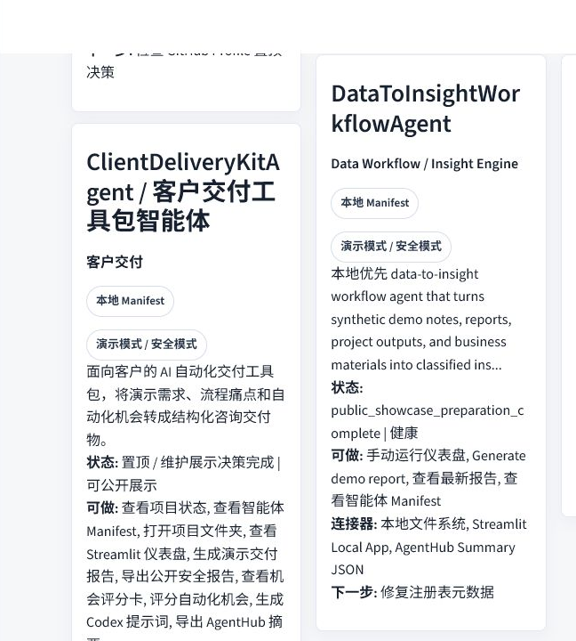

# DataToInsightWorkflowAgent

中文名：数据洞察工作流智能体

一句话定位：一个本地优先、安全演示模式的数据洞察工作流智能体，把杂乱资料转化成高价值信号、优先级判断和下一步行动建议。

English tagline: A local-first, public-safe data-to-insight workflow agent that turns messy demo files, notes, reports, and project outputs into ranked insight signals, action recommendations, and AgentHub-ready exports.

## 为什么做这个项目

很多有价值的信息不是不存在，而是散落在学习笔记、项目输出、业务反馈、求职材料和市场观察里。D2I 的目标不是做一个“万能总结器”，而是展示一个更产品化的 AI workflow：

```text
Input -> Normalize -> Classify -> Score -> Filter -> Analyze -> Export -> Dashboard
```

这个项目适合作品集展示，因为它体现了：

- 从杂乱输入到结构化洞察的产品化思路
- 分类、评分、过滤、行动建议的 workflow 设计能力
- 商业洞察、信息差识别、认知差整理和项目机会判断
- local-first / public-safe / demo-mode 的工程边界意识
- Streamlit dashboard 和 AgentHubControlCenter 的中台集成能力

## 当前阶段

当前 checkpoint：

`D2I-006-SCREENSHOT-CAPTURE-AND-README-SCREENSHOT-UPDATE-COMPLETE`

D2I-006 已完成真实 public-safe 截图采集和 README 截图区更新。9 张截图均来自本地运行的 D2I Dashboard 或 AgentHubControlCenter，不使用伪造截图。

当前仍未 GitHub public release，未 Profile Pin，未执行 git add/commit/push。

## 核心工作流

```text
demo_data/demo_items.json
-> data intake
-> normalization
-> classification
-> multi-dimensional scoring
-> noise filtering / review queue
-> insight signal extraction
-> action recommendation
-> Markdown report export
-> AgentHub summary JSON export
-> Streamlit dashboard
```

## 功能亮点

- Synthetic demo data intake：只使用 public-safe demo items
- Normalization：把杂乱文本标准化为可处理结构
- Classification：识别学习、项目、商业、求职、噪音和待复核类别
- Value scoring：用多维评分判断商业价值、项目价值、作品集价值和行动价值
- Noise filtering：把低价值和证据不足内容放入 noise/review queue
- Insight extraction：提取关键观察、证据和可能用途
- Action recommendation：输出下一步行动、目标 agent 和优先级
- Markdown report export：生成 `outputs/demo_insight_report.md`
- AgentHub export：生成 `outputs/agenthub_summary.json`
- Streamlit dashboard：提供可截图、可演示的产品界面

## Dashboard 预览说明

Dashboard 目前包含：

1. Hero / Project Header
2. Sidebar filters
3. Overview metrics
4. Workflow map
5. High-value signals
6. Action board
7. Noise / review queue
8. Processed items table
9. Export / AgentHub panel
10. Public-safe notice

截图文件已完成采集，截图计划和状态见 `docs/SCREENSHOTS_GUIDE.md`。

## Screenshots / Dashboard Preview

### 1. Dashboard Hero



### 2. Overview Metrics



### 3. Workflow Map



### 4. High-value Signals



### 5. Action Board



### 6. Noise / Review Queue



### 7. Processed Items Table



### 8. Export / AgentHub Panel



### 9. AgentHubControlCenter Integration



## Demo Pipeline

运行 demo pipeline：

```powershell
python -m data_to_insight.cli run-demo
```

当前 public-safe demo summary：

- Total items processed: 14
- High-value signals: 4
- Medium-value items: 5
- Low/noise/review items: 5
- Recommended actions: 23
- Markdown report: `outputs/demo_insight_report.md`
- AgentHub summary: `outputs/agenthub_summary.json`

更多说明见 `docs/DEMO_REPORT_OVERVIEW.md`。

## AgentHub Integration

D2I 已完成 AgentHubControlCenter 本地集成准备。AgentHub 可以读取：

- `agent_manifest.json`
- `agent_contract.json`
- `outputs/agenthub_summary.json`
- `docs/AGENTHUB_HANDOFF.md`

AgentHub 中可展示 D2I 的名称、中文名、category、checkpoint、local-first/public-safe/demo-mode 标记、capabilities、dashboard path、report path、summary path 和 summary metrics。

更多说明见 `docs/AGENTHUB_SHOWCASE_NOTES.md`。

## Public-Safe / Demo-Mode 边界

This project uses synthetic demo data only. No real connector is enabled. No external API call is made. No `.env`, token, credential, or secret is required. No real user file is processed.

本项目只使用 synthetic demo data，不接真实 connector，不调用外部 API，不读取 `.env`、token、credential 或 secret，不处理真实用户文件。

当前不做：

- Gmail / Google Drive / Notion / web connector
- LLM API
- OCR / PDF ingestion
- real customer data
- private file upload
- automatic GitHub release

安全边界见 `docs/SECURITY_AND_PRIVACY.md`。

## 快速启动

建议先运行 demo pipeline，再打开 dashboard：

```powershell
python -m data_to_insight.cli run-demo
python -m streamlit run app.py
```

如果 outputs 不存在，Dashboard 会尝试基于 synthetic demo data 刷新本地输出。

## 测试命令

```powershell
python -m pytest -q
python -m compileall .
python tools/public_release_check.py
```

Streamlit smoke check 示例：

```powershell
python -m streamlit run app.py --server.headless true --server.port 8523
```

打开 `http://127.0.0.1:8523` 检查 HTTP 200 后停止进程。

## 项目结构

```text
DataToInsightWorkflowAgent/
├── app.py
├── README.md
├── PROJECT_STATUS.md
├── requirements.txt
├── .gitignore
├── agent_manifest.json
├── agent_contract.json
├── data_to_insight/
│   ├── cli.py
│   ├── pipeline.py
│   ├── classifier.py
│   ├── scorer.py
│   ├── recommender.py
│   ├── agenthub_exporter.py
│   └── ui_helpers.py
├── demo_data/
│   └── demo_items.json
├── docs/
│   ├── SCREENSHOTS_GUIDE.md
│   ├── PUBLIC_RELEASE_CHECKLIST.md
│   ├── SECURITY_AND_PRIVACY.md
│   ├── DEMO_REPORT_OVERVIEW.md
│   ├── AGENTHUB_SHOWCASE_NOTES.md
│   └── PUBLIC_SHOWCASE_MANIFEST.md
├── release/
│   └── public_showcase_manifest.json
├── tools/
│   └── public_release_check.py
├── outputs/
│   └── .gitkeep
└── tests/
```

## Public Showcase 状态

当前已经完成 D2I-006 screenshot capture and README screenshot update，但 `public_release_ready` 仍为 `false`，原因是 GitHub 发布前还需要 D2I-007 最终人工安全检查和明确发布授权。

公开展示准备文件：

- `docs/SCREENSHOTS_GUIDE.md`
- `docs/PUBLIC_RELEASE_CHECKLIST.md`
- `docs/FINAL_PROJECT_SUMMARY.md`
- `docs/DEMO_REPORT_OVERVIEW.md`
- `docs/SECURITY_AND_PRIVACY.md`
- `docs/AGENTHUB_SHOWCASE_NOTES.md`
- `docs/PUBLIC_SHOWCASE_MANIFEST.md`
- `release/public_showcase_manifest.json`
- `tools/public_release_check.py`

## Roadmap

- D2I-001：项目规划、工作流地图、评分框架、AgentHub 契约
- D2I-002：Synthetic demo data pipeline MVP
- D2I-003：Streamlit dashboard MVP
- D2I-004：AgentHubControlCenter integration
- D2I-005：Public showcase preparation
- D2I-006：Screenshot capture and README screenshot update
- D2I-007：GitHub public release
- D2I-008：Optional Profile Pin decision

## Disclaimer

DataToInsightWorkflowAgent is a portfolio demo and local workflow prototype. It does not provide legal, financial, hiring, or business advice. Demo outputs are synthetic and should be manually reviewed before any public use.
